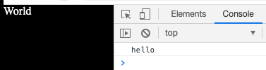
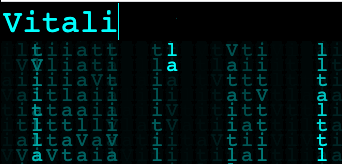

## Topic

```text
Simple project structure with static assets for web project.
In this section we will take a look at the very trivial project setup,
consisting from static assets.
In next lessons we will learn more complex setups.
However they will also have the same principles described here.
Also the purpose of this section is to remind how JS works in sync
with other web technologies.
```

### Additional reading

HTML intro: https://www.w3schools.com/html/html_intro.asp

CSS intro: https://www.w3schools.com/html/html_css.asp

NPX utility: https://medium.com/@maybekatz/introducing-npx-an-npm-package-runner-55f7d4bd282b


### Exercise 1

`Estimated time: 5-15 min`

Create a basic project structure with the following shape:
- `/src`
    - `/styles.css`
    - `/app.js` 
- `/index.html` create a dummy html file with "world" text inside body tag
 
Write css to make body background black and text color white

Write code to say "hello" with any of your teammate's name with console after 2 seconds when page is loaded
 
Render your page and check the result similar to:


 
### Exercise 2

`Estimated time: 5-15 min`
 
Replace the contents of the body tag in newly created index.html file `<body>...</body>`: 

```html
<input id="phrase" type="text" value="JS/TS Bootcamp - Workshop 1">
<canvas id="canvas"></canvas>
```

Add inline styles to the head tag section:
```css
input {
    background:#000;
    opacity:0;
}
```

Move your "hello" js code to inline script and replace app.js file with the content of the wallpaper lib in the assets folder: 
`src/w-01/01-static-assets/assets/wallpaper.min.js`

Open `index.html` page in the browser. Examples how to do it:

- IDEA or WebStorm Run command from context menu - it should rub web-server
- Run webserver by your own with NPX utility from the root of the project `npx http-server -p 7777`
- Open file from the file system with browser
- VSCode Live Server plugin - after installing it you will have an option in context menu
- Surge deployment service https://surge.sh/

Example how to run webs-server with NPX utility:

Run the following command from the directory with your files `npx http-server@0.12.0 -p 7777`
```shell script
$ npx http-server@0.12.0 -p 7777
npx: installed 26 in 2.171s
Starting up http-server, serving ./
Available on:
  http://127.0.0.1:7777
  http://192.168.1.34:7777
Hit CTRL-C to stop the server
```

Finally, write your name or any other combination of symbols in the input and enjoy the view:



### Notes


JS code injection:

Concensus seems to be that there are two sensible places to put scripts:

In the `<head>` section:

```
Pro: Scripts are loaded before content, so dynamic behaviors can be applied before the user can interact with the page.
Con: users have to wait while scripts are downloaded and applied, which can lead to higher bounce rates and generally poorer performance.
```

Just before the `</body>` tag:

```
Pro: content is loaded and visible to the user as soon as possible.
Con: dynamic behaviours, effects, etc, are not immediately applied.
```

Projects that use Webpack or any other similar bundlers at the end finally
output the compiled and minified js and css assets and inject theme into html.
