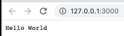
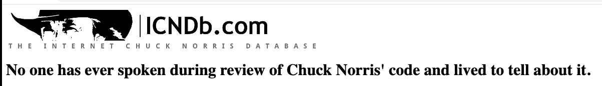

## Topic

```text
Simple project structure for server-side web application.
In this section we will take a look at the very trivial project setup
in Node.js.
```

### Additional reading


Node.js: https://nodejs.org/en/

Node.js hello world example: https://nodejs.org/en/docs/guides/getting-started-guide/

Node.js module exports: https://www.tutorialsteacher.com/nodejs/nodejs-module-exports

HTTP headers | Content-Type:  https://www.geeksforgeeks.org/http-headers-content-type/

Chuck Norris biography: https://en.wikipedia.org/wiki/Chuck_Norris

### Exercise 1

`Estimated time: 5 min`

Create a basic project structure with the following shape:

- `/index.js` a dummy file

Replace your dummy js file with the hello world example from the official documentation

```javascript
const http = require('http');

const hostname = '127.0.0.1';
const port = 3000;

const server = http.createServer((req, res) => {
  res.statusCode = 200;
  res.setHeader('Content-Type', 'text/plain');
  res.end('Hello World');
});

server.listen(port, hostname, () => {
  console.log(`Server running at http://${hostname}:${port}/`);
});
```

Run in the terminal

```shell script
node index.js
```
Your console should print (if no errors like port already in use) the following output:

```shell script
$ 02-nodejs-base % node index.js
Server running at http://127.0.0.1:3000/
```

Open the url in the browser and you will see the greeting:




### Exercise 2

`Estimated time: 5-15 min`

Update project structure with the following shape:
- `/src`
    - `/cn.js` - copy file content from `src/w-01/02-nodejs-base/assets/cn.js`
- `/index.js` - keep existing file

Your task here will be to create a simple web application that will return the random joke about
Chuck Norris and output it on the screen:




### Notes

Take in mind your output, good frameworks have additional filtering
and protection against code injections.

More information on the topic:

XSS attacking: https://owasp.org/www-community/attacks/xss/

HTML Sanitizing and XSS prevention libraries:

https://www.npmjs.com/package/sanitize-html

https://www.npmjs.com/package/xss


