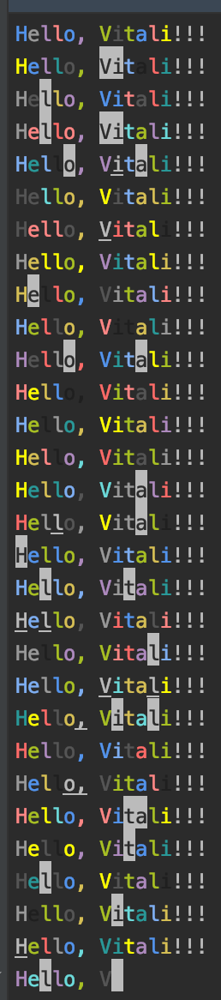

## Topic

```text

In this section we will learn about project setup and dependencies management.
We we will cover most typical use cases from package installation,
versions bumping and special cases, like working with cache and registry.
We will shortly touch code validation and testing topics.
You will learn how to setup linter and unit tests.
After this workshop you will be able to reuse codebase from JS ecosystem
```

### Additional reading

NPM:

What is NPM in short video: https://www.youtube.com/watch?v=x03fjb2VlGY

NPM packages and modules: https://docs.npmjs.com/about-packages-and-modules

Specifying dependencies and devDependencies: https://docs.npmjs.com/specifying-dependencies-and-devdependencies-in-a-package-json-file

Semantic versioning:
* https://docs.npmjs.com/about-semantic-versioning
* https://www.youtube.com/watch?v=kK4Meix58R4
* https://semver.npmjs.com/
* https://classic.yarnpkg.com/en/docs/dependency-versions


Yarn usage:

https://classic.yarnpkg.com/en/docs/usage


ESLint and rules:

https://eslint.org/

https://eslint.org/docs/rules/

### Exercise 1

`Estimated time: 10-15 min`

Create a folder `greeting-utils` and a dummy file, e.g. `index.js`.

Change the current directory for `npm` folder and init the project with NPM (`npm init`)

It will ask you several questions and finally create a `package.json` file (you should name the package `greeting-utils`,
it will be needed in next exercises) 

Change your `index.js` file contents to the following code
(spoiler: it has some issues, we will fix them later with linter)

```javascript
function exclamate(message) {
    console.log(`${message}!!!`);;
}

module.exports = exclamate
```

Install with npm `eslint` as dev dependency - `npm install eslint --save-dev`.

A file `package-lock.json` was automatically created by npm. Important to mention that
if you have your own project and use npm and package manager, it is important to add
this file to source control system to have consistency in your dependencies. We will
have very similar file `yarn.lock` in another exercise.

Now create a file `.eslintrc.js` and fill with the following content:

```javascript
module.exports = {
    "env": {
        "node": true,
        "commonjs": true,
        "es6": true
    },
    "extends": "eslint:recommended",
    "rules": {
        "semi": ["error", "never"],
        "no-console": ["warn"],
    }
};
```

You left only last thing to start linting your code.

To have ability enable linting on CI
and omit any issues with binary and versions inconsistencies
let's extend scripts's section in package.json with the following line:
 
`"lint": "./node_modules/.bin/eslint *.js"`

Now run this command with npm - `npm run lint`, you should get the following output:

```shell script
(base) User:greeting-utiles $ npm run lint

> greeting-utils@1.0.0 lint .../greeting-utiles
> eslint *.js


.../greeting-utiles/index.js
  2:3   warning  Unexpected console statement  no-console
  2:31  error    Extra semicolon               semi
  2:32  error    Unnecessary semicolon         no-extra-semi

  3 problems (2 errors, 1 warning)
  2 errors and 0 warnings potentially fixable with the `--fix` option.
```

Let's see and fix what is the issue, but do this using the suggested option` --fix`.

Extend scripts's section in package.json with the following line:
 
`"lint:fix": "npm run lint -- --fix"`

Call `npm run lint:fix` form terminal and compare `index.js` with the previous version.
Part of the problems are resolved automatically by the eslint, which is quite good
as it could save significant amount of time in case you decided to change styles
across the whole project or e.g. just enter somebody's project from github and want
have consistent code.

Now run linting command again - `npm run lint` and see the output:

```shell script
greeting-utils/index.js
  2:3  warning  Unexpected console statement  no-console

  1 problem (0 errors, 1 warning)
```

Now we have only a warning, it is complaining on the console statement, however
it is required part of our greetings lib and we need some way to tell the linter that
this place is valid. To do that we will disable this particular line.

Put a comment above the console call:  `// eslint-disable-next-line no-console`

Now run linting command again - `npm run lint`, the warning should be fixed.

Let's change the rule `semi` to make semicolons obligatory:

Open `https://eslint.org/docs/rules/semi` for reference. It would be a description about
`never | always` options. Change `"semi": ["error", "never"],` to
`"semi": ["error", "always"],`.

Run and fix errors again and compare results.

In the next exercise we will write a first unit test.

Questions ??? 

### Exercise 2

`Estimated time: 20-30 min`

In this exercise we will do a basic unit testing setup.

We will start with a testing framework jest (https://jestjs.io/)
  
First let's install it with the following command:

`npm i -D jest` - now we will use npm shortcuts, `install` -> `i`, `--save-dev` -> `-D` 

As soon as it is finished, update package.json file section with the following line  

`"test": "./node_modules/.bin/jest",`

Now test jest is installed correctly with simple version check:

`npm run test -- -v` - it should return version if installed correctly.

Now is the time to write unit test to the code we wrote as running `npm run test`
will return message `No tests found`.

Create new file `index.test.js` in the same folder `greeting-utils` near the `index.js` file.

Modify your `index.js` file to export your function `exclamate`

```javascript
module.exports = {
  exclamate: exclamate,
};
```

In `index.test.js` import this function and create the template for your first test:

```javascript
test("exclamate", () => {
    exclamate("hi")
    expect(true).toBe(true)
});
```

Note, if you call linter now, it will complain on undefined vars:

```shell script
   3:1   error  'test' is not defined    no-undef
   5:5   error  'expect' is not defined  no-unde
   ...
```

To fix this error you will need to extend your `.eslint.js` file with the following code:

```javascript
module.exports ={
    // ...
    "overrides": [
        {
            "files": [
                "**/*.test.js"
            ],
            "env": {
                "jest": true
            }
        }
    ]
}
```

Now call your test command again: `npm run test`

It should finally find the test and execute it. You will see `hi!!!` and test passing.
Though test is totally useless except the fact that we checked that jest is working.

As function is impure (we will learn or repeat what are pure and impure functions
in next workshops) and no value is returned we will need a way how to test it.

There are minimum 2 options we could do to test our function.

First option. We could refactor this function - separate the logic of preparing
message (we will even have a new useful method in our API if somebody will want
to save it to DB or send via the network) and posting it into the console.

Second options - we could mock with `jest` the `console.log` call
and check it's arguments passed.

Let's finally do both and get familiar with syntax.

First let's refactor the message creation. 

```javascript
function getExclamationMessage(message) {
  return `${message}!!!`
}
```
Don't forget to update your exports:

```javascript
module.exports = {
  exclamate: exclamate,
  getExclamationMessage: getExclamationMessage,
};
```

And finally let's update the test: 

```javascript
test("should prepare exclamation message", () => {
    const message = getExclamationMessage("hi")
    expect(message).toBe("hi!!")
});
```

... Ups, something is wrong, test failing. We forgot one more exclamation mark.
Update, run test again, verify it is passing!

Now let's verify console is called.
Copy your previous test, change message and function called:

```javascript
test("should post exclamation message to console", () => {
    exclamate("hi")
    expect(message).toBe("hi!!!")
});
```

Here is an example how you could create a spy, a mocking object:

```javascript
const logSpy = jest.spyOn(global.console, 'log');
```

Now change your test and run it:

```javascript
test("should post exclamation message to console", () => {
    const logSpy = jest.spyOn(global.console, 'log');
    exclamate("hi");
    expect(logSpy).toBeCalled()
});
```

Now we see that test is passing! Good job! But there is an issue...

There is a side effect - take a look on the output:

```shell script
console.log
    hi!!!
```

Let's fix it with jest's `.mockImplementation(mockFn)`:

```javascript
test("should post exclamation message to console", () => {
    const logSpy = jest.spyOn(global.console, 'log').mockImplementation(jest.fn());
    exclamate("hi");
    expect(logSpy).toBeCalled()
});
```

No more console logging should be seen in jest output.

Additionally you could test your argument `expect(logSpy).toBeCalledWith("hi!!!")`.

### Exercise 3

`Estimated time: 10-15 min`

This is an approach opposite to test driven development - we wrote functionality and
then covered it with tests. (TDD - first write test, then write implementation.)

Let's write code with TDD: we will create a function that will collect
"the exclamation power" of the message.

The basic formula would be very simple - the power of two of message length:
`length ^ 2`

Your task now would be to create a failing test for the `pow` function without it's
implementation (don't forget, however, to export function and make it's template),
then finish the `pow` function with the correct implementation.

You could power with: `Math.pow(x, p)`

### Exercise 4

`Estimated time: 5-10 min`

Next task is to extend the `pow` function with the second argument,
so the formula will be changed to `length ^ power`, where `power`

If the second argument is not passed, then you should use `2` by default.

So start again with tests and finish with correct implementation.

### Exercise 5

`Estimated time: 5-10 min`

In this exercise we will just do more practice with the already known material.

Task: implement a function `times(fn, n)` using TDD approach, which will take another function `fn`
and run it `n` times: `function times(fn: () => any, n: number)`.


### Exercise 6

`Estimated time: 5-10 min`

In this exercise we will practice with the npm cache.

To change your cache dir you need to call npm install 
with `--cache path/to/some/folder`.


Let's install a dummy package `hello-world-npm` to the `local-cache` folder.

Run `npm i --cache ./local-cache hello-world-npm`

NPM will install `hello-world-npm` package, add it to `package.json` 
 
Run `npm cache clean --force --cache local-cache`

NPM will clear the cache internal folder with dependencies.  

Run `npm uninstall hello-world-npm` or `npm r hello-world-npm`

NPM will uninstall `hello-world-npm` package and remove it from `package.json`

Note:

Cache management could be useful, e.g.in CI. You could optimize your installation phase with
creating artifacts with cached modules and use it with this configuration on install.

### Exercise 7

`Estimated time: 5-10 min`

In this exercise we will increase our package quality by writing Typescript declaration files
(https://www.typescriptlang.org/docs/handbook/declaration-files/introduction.html).

It is rather special case, however sometimes you could have libraries without types and it would be
worth to know how to do it.

Create `index.d.ts`

Add first declaration file

```typescript
export declare function exclamate(message: string): void;
```

Now when importing `exclamate` from `index.js` the function will have needed types.

Now add support for the `pow` and `times` functions.

### Exercise 8

`Estimated time: 10-15 min`

In this exercise we will create a new package and we will do it with Yarn.

Create another directory `greeting-cli` and create the package `greeting-cli` by calling
`yarn init`.

To install dependency you could use `yarn add <package-name>`.

To install dev dependency you could use `yarn add -D <package-name>`.

Install Typescript with `yarn add -D typescript`

Install TS-Node with `yarn add -D ts-node`

To have nodejs types we will need one more package `yarn add -D @types/node`

Now extend `package.json` with start section

```json
{
    "scripts": {
        "start": "ts-node index.ts"
    }
}
```

Create a file `index.tx` with the following contents:

```typescript
const message: number = "hello";

console.log(message);
```

And finally run `yarn start`

You will get the following error, telling that you have incorrect types:

```shell script
TSError:  Unable to compile TypeScript:
index.ts:1:7 - error TS2322: Type 'string' is not assignable to type 'number'.

1 const message: number = "hello";
```

Fix the types to be able run the script and then run `yarn start` again.

### Exercise 9

`Estimated time: 10-15 min`

Now we will need the package `greeting-utils` we wrote in the previous exercise.

In the real world scenarios packages are published into registries.

NPM is configured to use npm, Inc.’s public registry at https://registry.npmjs.org

For Yarn it's usually https://registry.npmjs.org/

We will skip this section for now and use `yarn link` utility.
It will help us imitate case when `greeting-utils` is installed in `node_modules`
and available via dependencies. How it works - it creates symlinks to the
linked directory.

Open new terminal and change current directory to the `greeting-utils`.

Call `yarn link` command there.

You should see:

```shell script
success Registered "greeting-utils".
info You can now run `yarn link "greeting-utils"`
in the projects where you want to use this package and it will be used instead.
```

Now return back to the `greeting-cli` and run `yarn link "greeting-utils"`

You should see:

```shell script
success Using linked package for "greeting-utils".
```

Now let's import utils from our module:

```typescript
import { exclamate } from "greeting-utils"

const message: string = "hello";

exclamate(message);
```

it should now output:

```shell script
$ ts-node index.ts
hello!!!
```

### Exercise 10

`Estimated time: 5-10 min`

Our hello greeting looks rather boring. Let's make it more interesting.

Task:

Install this module: https://www.npmjs.com/package/colors
And make hello message output with different colors.

Note:

- I expect this package to work in 90% of cases, however in case your console
doesn't support this finally after install, no worries, we will have one more
task.
- To use this package with typescript you will need to install @types.

### Exercise 11

`Estimated time: 15-20 min`

Now it is time to make our CLI extendable with arguments.

Task:

- Install this module: https://www.npmjs.com/package/yargs
- Make it possible to pass message with arguments when `yarn start -m "hello"`
- Make it possible to pass power with arguments when `yarn start -p 5`
- Apply passed arguments in `index.ts` and use them to make a greeting by the
following principle: Call `exclamate` `n` times, where `n` is the "power"
of the passed message.
- Message should output random colors each time it is exclamated
- Extend `ts-node` call with `--transpile-only` flag (attention, it will skip the
typecheck, transpile code to JS and run it via node)

Note:

- I expect this package to work in 90% of cases, however in case your console
doesn't support this finally after install, no worries, we will have one more
task.
- To use any package normally with typescript which doesn't have types by default,
 you will need to install @types/<module-name>.

Enjoy the fun of the final project:



### Notes

Rules and tips for package naming:

- Must be less than or equal to 214 characters(including the @scope/ for scoped packages).
- Must not start with a dot (.) or an underscore (_).
- Must not have an uppercase letter in the name.
- Must use only URL-safe characters.
- Don’t use the same name as a core Node.js module
- Don’t put js or node in the name.
- Keep names short and descriptive. You want people to understand what it is from the name, but it will also be used in require() calls.
- Make sure that there isn’t something in the registry with the same name.

ESLint config creation:
You could init your own config with `eslint --init`
or if binary is not available `./node_modules/.bin/eslint --init`.
There are several formats (`json`, `yaml`, `js`)
in which you could store your config, however, if you have js format, 
you could have more control, e.g. you could change your rules
by checking env variables.  

Versioning cheatsheet:

- Tilda ~ is for patches 1.0.x
- Caret ^ is for minor releases 1.x


Differences between yarn and npm:

https://www.geeksforgeeks.org/difference-between-npm-and-yarn/

Sending command line arguments to npm (`npm run server -- --port=1337`):

https://stackoverflow.com/questions/11580961/sending-command-line-arguments-to-npm-script

What is package-lock.json:

https://docs.npmjs.com/configuring-npm/package-lock-json.html#:~:text=Description-,package%2Dlock.,regardless%20of%20intermediate%20dependency%20updates.

Jest Testing Framework:

https://jestjs.io/

