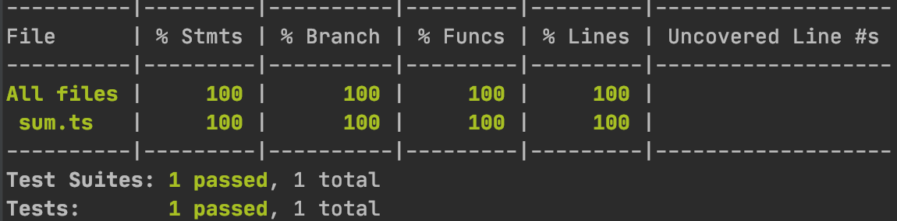
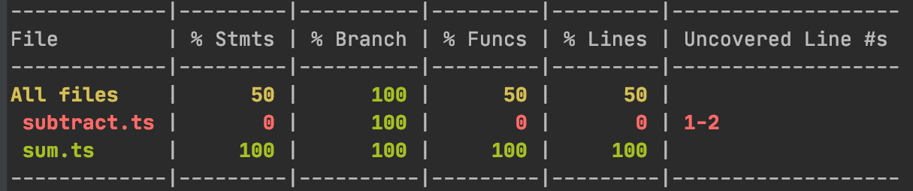
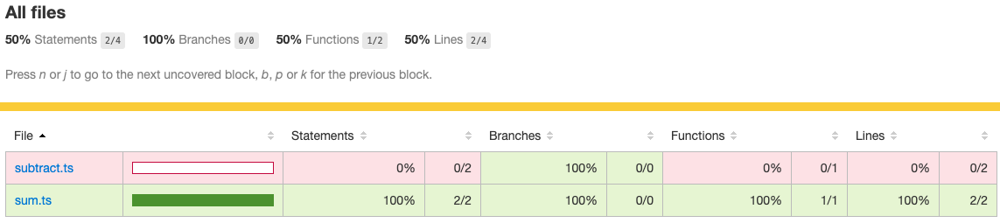
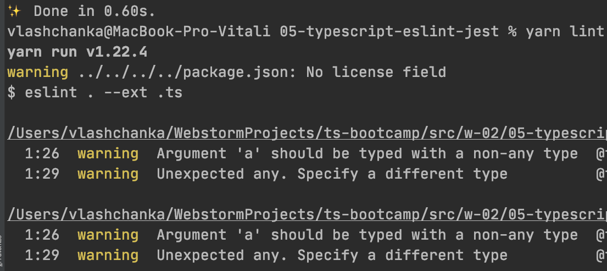
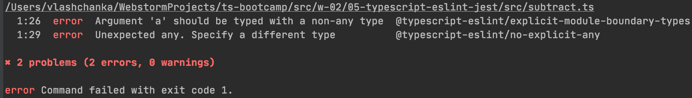

## Topic

```text
Setting up eslint and jest with Typescript
```

### Additional reading

Airbnb style guide:

https://github.com/airbnb/javascript

Typescript ESLint:

https://github.com/typescript-eslint/typescript-eslint

Typescript Jest:

https://jestjs.io/docs/en/getting-started#using-typescript

https://github.com/kulshekhar/ts-jest

### Exercise 1

`Estimated time: 10-15 min`

#### TS-Jest installation and basic config

Call `yarn init -y` to create empty project.

Call `yarn add -D jest typescript` to add jest and typescript

Call `yarn add -D ts-jest @types/jest` 
to install `ts-jest` and ambient types for jest.

Call the command `yarn ts-jest config:init`, it should 
generate you the jest config:

```shell script
Jest configuration written to 
"ts-bootcamp/src/w-02/05-typescript-eslint-jest/jest.config.js".
```

With the following contents:

```js
module.exports = {
  preset: 'ts-jest',
  testEnvironment: 'node',
};
```

Add a new section to `package.json`:

```json
  "scripts": {
    "test": "jest"
  },
```

Run `yarn test` and verify that jest is running, but failing that there are no tests.

Copy `ts-bootcamp/src/w-02/05-typescript-eslint-jest/assets/src` base folder
to your root `ts-bootcamp/src/w-02/05-typescript-eslint-jest`.

Run `yarn test --watch` - it should enable Jest watch mode 
that will automatically enable Jets reruns based on file system changes.

Now your task is to write a first unit test for `sum.test.ts` file.


### Exercise 2

`Estimated time: 10-15 min`

#### Code coverage

Update `package.json` scripts section with new command:

`"test:coverage": "jest --coverage"`

Run `yarn test:coverage`.

It should generate you the coverage report:



However, we have only sum function coverage, 
if we want to have coverage for all the codebase, we will need
additional parameter `collectCoverageFrom`.

Update your config to have the line `collectCoverageFrom: ['src/**/*.ts'],`:

```js
module.exports = {
  preset: 'ts-jest',
  testEnvironment: 'node',
  collectCoverageFrom: ['src/**/*.ts'],
};
```

Run `yarn test:coverage` again. You should get the `subtract` 
function report.



### Exercise 3

`Estimated time: 5-10 min`

#### Coverage report

You may notice that now your folder contains a `coverage` folder.
It has html report inside. Let's open it with previously learned 
npm module `http-server`:

Let's add one more item to scripts section in the `package.json`:

`"test:report": "cd coverage/lcov-report && npx http-server@0.12.0 -p 7777 -o -c-1"`

Run `yarn test:report`.

You should see the similar report in opened page:



### Exercise 4

`Estimated time: 5-10 min`

#### ESLint with Typescript

Run this command: 
`yarn add -D eslint @typescript-eslint/parser @typescript-eslint/eslint-plugin`
to install the required dependencies

Create `.eslintrc.js` config file in the root of your 
project, and populate it with the following content:

```js
module.exports = {
  root: true,
  parser: '@typescript-eslint/parser',
  plugins: [
    '@typescript-eslint',
  ],
  extends: [
    'eslint:recommended',
    'plugin:@typescript-eslint/recommended',
  ],
};
```

Now add the command in `package.json`:

```json
{
  "scripts": {
    "lint": "eslint . --ext .ts"
  }
}
```

Run new command `yarn lint`: 



### Exercise 5

`Estimated time: 5-10 min`

#### ESLint rules setup and ignoring techniques 

Those warnings indicate at least 2 things:

- Linter is running against unneeded folder `assets/src`
- Argument `a` is typed with `any` type, which means we could have errors in runtime

Let's create `.eslintignore` file and add `assets/src` there.

Note: other places you want to ignore:
```text
# don't ever lint node_modules
node_modules
# don't lint typescript output dir
lib
# don't lint coverage output
coverage
```

Let's extend the rule from warnings in `.eslint.js`
with the following content:
```json
    "overrides": [
        {
            "files": ["*.ts"],
            "rules": {
                "@typescript-eslint/explicit-module-boundary-types": ["error"],
                "@typescript-eslint/no-explicit-any": ["error"],
            }
        },
    ]
```
 
Run linting command again `yarn lint`: 



Now the described issues are away.

Sometimes it is needed to disable rules. As an example
of the comment to disable the violated above rule in code:

`// eslint-disable-next-line @typescript-eslint/explicit-module-boundary-types`

Now after running the linting command:

```shell script
/Users/vlashchanka/WebstormProjects/ts-bootcamp/src/w-02/05-typescript-eslint-jest/src/subtract.ts
  2:29  error  Unexpected any. Specify a different type  @typescript-eslint/no-explicit-any

✖ 1 problem (1 error, 0 warnings)
```

### Exercise 6

`Estimated time: 5-10 min`

#### ESLint setup with predefined configs from ecosystem

There are many configuration packages in the ecosystem - these 
packages that exist solely to provide a comprehensive base config 
for you, with the intention that you add the config and it gives 
you an opinionated setup.


As an example how to enable something more advanced, let's 
install the predefined config from airbnb: `https://www.npmjs.com/package/eslint-config-airbnb-typescript`

Install the plugin and it's dependencies:

`yarn add -D eslint-config-airbnb-typescript eslint-plugin-import@^2.22.0 eslint-plugin-jsx-a11y@^6.3.1 eslint-plugin-react@^7.20.3 eslint-plugin-react-hooks@^4.0.8 @typescript-eslint/eslint-plugin@^4.2.0`

Add the `tsconfig.json` file (same config we had last time) to the root of your application:

```json
{
  "compilerOptions": {
    "outDir": "lib",
    "strict": true,
    "lib": ["ES2019"],
    "sourceMap": true,
    "declaration": true,
    "module": "commonjs",
    "target": "ES2019"
  },
  "include": [
    "./src/**/*.ts"
  ],
  "exclude": [
    "node_modules"
  ]
}
```

Update your `.eslintrc.js` file to have the following structure:

```js
module.exports = {
    root: true,
    parserOptions: {
        tsconfigRootDir: __dirname,
        project: ['./tsconfig.json'],
    },
    parser: '@typescript-eslint/parser',
    plugins: [
        '@typescript-eslint',
    ],
    extends: [
        'airbnb-typescript',
    ],
    "overrides": [
        {
            "files": ["*.ts"],
            "rules": {
                "@typescript-eslint/explicit-module-boundary-types": ["error"],
                "@typescript-eslint/no-explicit-any": ["error"],
                // To omit default exports
                "import/prefer-default-export": "off"
            },
            // To omit: error  'test' |'expect' is not defined    no-undef
            "env": {
                "jest": true
            }
        },
    ]
};
```

Now your task is to fix all linting errors and reach 100% coverage.

### Notes

ESLint: another options to ignore files could be:

`"ignorePatterns": ["assets/src/**/*.ts"],`

https://eslint.org/docs/user-guide/configuring#ignoring-files-and-directories
