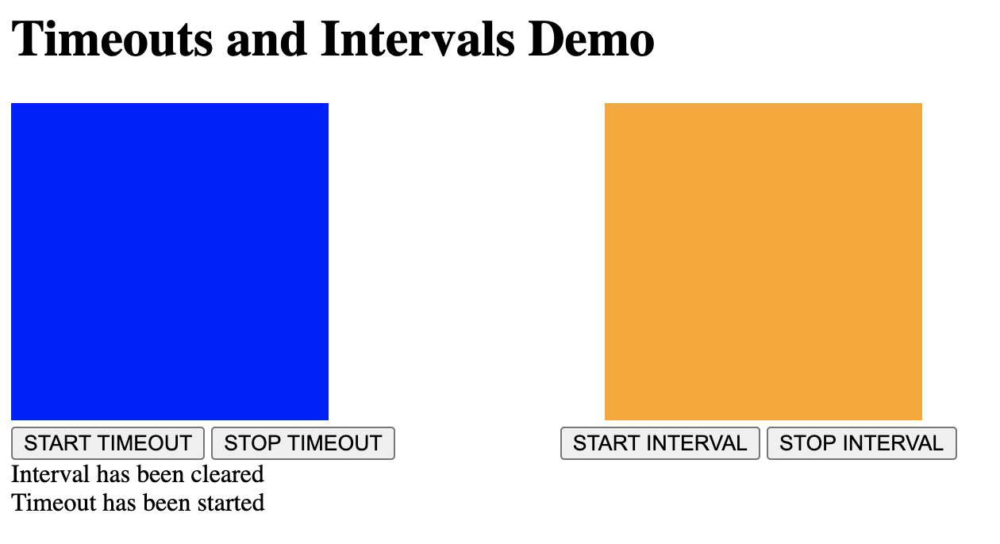
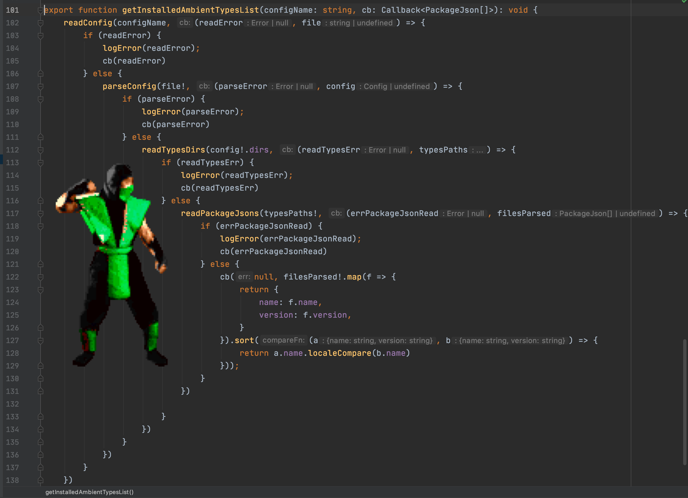

## Topic

```text

In this section we will work with async JS.

Topics covered:

- Timeouts / Timers
- Callback API / "Callback Hell"
- Promises
- async/await 

```

### Additional reading

Timers:

https://javascript.info/settimeout-setinterval

Callbacks in Node.js:

https://github.com/maxogden/art-of-node#callbacks

Jest snapshot testing:

https://jestjs.io/docs/en/snapshot-testing

Typescript Type guards:

https://www.typescriptlang.org/docs/handbook/advanced-types.html#user-defined-type-guards

Promises:

https://developer.mozilla.org/en-US/docs/Web/JavaScript/Reference/Global_Objects/Promise

### Exercise 1

`Estimated time: 5-10 min`

#### Timeouts and Intervals introduction

One of the simplest kinds of asynchrony is when you want 
to run some code after a certain amount of time has elapsed.

Open 
`ts-bootcamp/src/w-03/09-async/assets/timeout-interval-demo`

Run the standard we used in previous workshops to run the 
server: `npx http-server@0.12.0 -p 7777 -o -c-1`

Play with the UI available 



Question: 

What is not okay with timing mechanics? How could it be improved ?

### Exercise 2

`Estimated time: 20-30 min`

#### Timeouts and Intervals aborting

Your task would be to write 2 methods and cover 
them with unit tests.

One method will call a function with the delay.
Second method will call a function infinite times with 
period. Both methods will need aborting functionality.

More detailed instructions on the function signatures 
would be inside `.ts` files.

Test scenarios names would be prepared, but you will need
to write tests implementation yourself.


Open folder `ts-bootcamp/src/w-03/09-async/assets/basics` and run `yarn` to install the dependencies.

Run `yarn test --watch`.

Open file `src/timers.ts` and start following the instructions written in comments.


### Exercise 3

`Estimated time: 5-10 min`

#### Callback API demo



Open file:

`ts-bootcamp/src/w-03/09-async/assets/basics/src/callbacks.ts`

Investigate what is not okay with the code. How could it be improved?


3 things to point here:

- Node.js `promisify` utility
- Jest snapshot functionality (`ts-bootcamp/src/w-03/09-async/assets/basics/src/callbacks.test.ts`)
- More typesage JSON parsing could be organized with the help of Type Guards:

```typescript
interface Config {
    dirs: string[];
}
function isConfig(obj: any): obj is Config {
    return typeof obj === "object"  
        && "dirs" in obj
        && Array.isArray(obj.dirs)
        && obj.dirs.every((s: any) => typeof s === "string")
}
```

### Exercise 4

`Estimated time: 10-15 min`

#### Callbacks API

Task: write script (using callback API) to read package.json file and extract module description.

Open file:

`ts-bootcamp/src/w-03/09-async/assets/basics/src/callbacks.ts`


### Exercise 5

`Estimated time: 15-25 min`

#### Promises API - fetch call to get the list of movie directors

Now that we’ve seen examples of callback asynchronous code we can introduce Promises, 
a core language feature designed to simplify asynchronous programming.

A Promise is an object that represents the result of an asynchronous computation. 
That result may or may not be ready yet, and the Promise API is intentionally vague 
about this: there is no way to synchronously get the value of a Promise; 
you can only ask the Promise to call a callback function when the value is ready.


Promises could be seen as a different way of working with callbacks.
One real problem with callback-based asynchronous programming is that it is common 
to end up with callbacks inside callbacks inside callbacks, with lines of code 
so highly indented that it is difficult to read.

Promises allow to re-express callbacks as a more linear Promise chain that tends to be 
easier to read and easier to reason about.

Another problem with callbacks is that they can make handling errors difficult.

Task: 

Run `yarn movies`, it should start the server.

Open `ts-bootcamp/src/w-03/09-async/assets/basics/src/promises.ts` and write a method using promises 
to get the list of directors.


### Exercise 6

`Estimated time: 10-15 min`


#### Promises API - fetch call to get the list of directors movies links

Task: 

- Write a method using promises to get the list of director movies links.
- Write a method using promises to fetch the url and parse it to json, refactor method getDirectors() from previous exercise


### Exercise 7

`Estimated time: 10-15 min`


#### Promises API - fetch call to get the list of directors movies links

Task: 

Write a method using promises to get the list of director movies links.

### Exercise 8

`Estimated time: 10-15 min`


#### Promises API - fastest promise

Task: 

Write a method using promises to get the fastest response 
from the recommendations API with the director.


### Exercise 9

`Estimated time: 10-15 min`


#### Async/Await API - rewrite "directors API" to async/await

Task: 

Rewrite Directors API with the help of async and await 

`ts-bootcamp/src/w-03/09-async/assets/basics/src/async-await.ts`


### Exercise 10

`Estimated time: 10-15 min`

#### Async/Await API - write new method to collect average score  of each movie

Task write a method to return the movies with the average score.

Hint: `http://localhost:3000/api/movies/3/reviews`

Expected:

```json
[{
      "id": 100500,
      "score": 9,
      "title": "Avatar"
}]
```

### Exercise 11 - Additional

`Estimated time: 10-15 min`

#### Promises API - Promise.allSettled

Open link and investigate how Promise.allSettled() works

https://codesandbox.io/s/promiseallsettled-forked-d4meh?file=/src/index.js


Notes:

- Always control  timeouts and intervals in your application, always think about cleanup,
uncontrolled timers 

Reptile Ninja image:


Callback hell original idea image:


