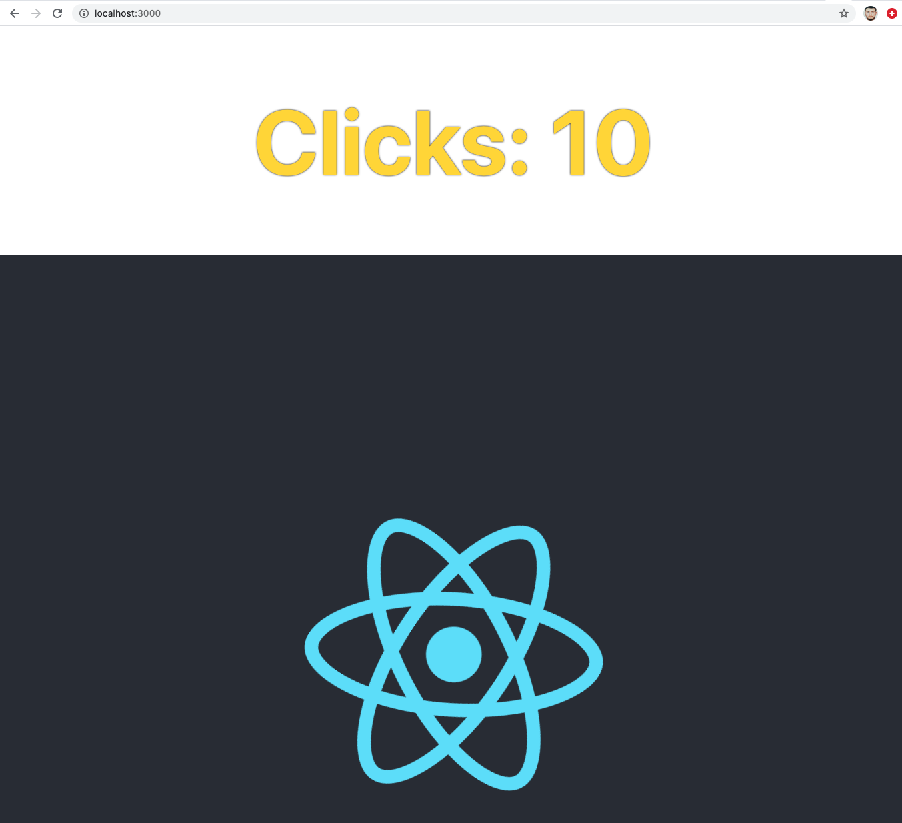

## Topic

```text
Quick bootsrapping of client-side application with `create-react-app` utility.
Create React App is an officially supported way to create single-page React applications. 
It offers a modern build setup with no configuration.
```

### Additional reading

Create React App:

https://create-react-app.dev/docs/getting-started/

### Exercise 1

`Estimated time: 5-10 min`

#### Creating a project

Call `npx create-react-app counter --template typescript` to create project template with Typescript.

Run `yarn start`


### Exercise 2

`Estimated time: 10-15 min`

### Creating counter component

Your task would be to create a counter component based on the following example`https://codepen.io/mliq/pen/QjdrgX`



### Exercise 3

`Estimated time: 10-15 min`

### Extend counter component

Task:

- Add additional `props` initCounter, it should control the
initial value of the counter e.g. `<Counter initCount={2}>`
- The initial value should be 0, it should be set using `defaultProps`
- Write unit test to cover this case (you could refer to App.test.tsx)


### Exercise 4

`Estimated time: 10-15 min`

### Extend counter component

Task:

- Add additional `props` step, it should control the
increment value, e.g. `<Counter initCounter={0} step={100}>`
after 2 clicks will have value `200`.
- Write unit test to cover this case

Note:

Types for testing library are not full, you could upgrade
types with: `yarn add @types/@testing-library__react`


### Notes

Ejecting functionality:

`https://create-react-app.dev/docs/available-scripts#npm-run-eject`
