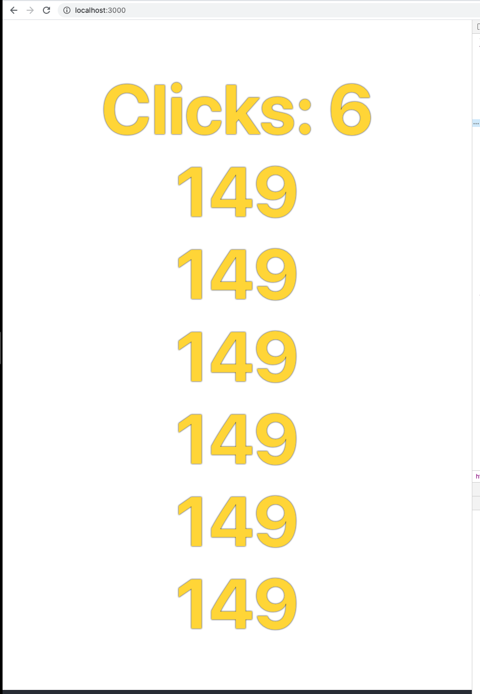

## Topic

```text
Introduction to React Hooks:
- Comparison with React class component lifecycle methods
- Using useState hook
- Using useEffect hook
```

### Additional reading

React hooks intro:

https://reactjs.org/docs/hooks-intro.html

### Exercise 1

`Estimated time: 10-15 min`

### Extend counter component

We will work in the project folder with base project:

`ts-bootcamp/src/w-04/11-create-react-app/assets/hooks`

Task:

- Add additional `props` step, it should control the
increment value, e.g. `<Counter initCounter={0} step={100}>`
after 2 clicks will have value `200`.
- Write unit test to cover this case

Note:

Types for testing library are not full, you could upgrade
types with: `yarn add @types/@testing-library__react`

### Exercise 2

`Estimated time: 10-15 min`

### Timer component

Task:

Create a timer component: `Timer`.

After it mounts, it should update after 1 second

```html
<div>Timer: 1</div> 
<!--One second passed: -->
<div>Timer: 2</div>
```

### Exercise 3

`Estimated time: 10-15 min`

### Timer component

Task:

Extend timer component: `Timer`.

It should be now configurable with optional props `start` and it should be by default still equal to 1

By default: 

```jsx
<Timer/>
```
```html
<div>Timer: 1</div> 
<!--One second passed: -->
<div>Timer: 2</div>
<!--One second passed: -->
<div>Timer: 2</div>
```

With start: 

```jsx
<Timer start={10}/>
```
```html
<div>Timer: 10</div> 
<!--One second passed: -->
<div>Timer: 11</div>
<!--One second passed: -->
<div>Timer: 12</div>
```

### Exercise 4

`Estimated time: 10-15 min`

### Timer component

Task:

Extend timer component: `Timer`.

It should be now configurable with optional props `step` and it should be by default still equal to 1

By default: 

```jsx
<Timer/>
```
```html
<div>Timer: 1</div> 
<!--One second passed: -->
<div>Timer: 2</div>
<!--One second passed: -->
<div>Timer: 2</div>
```

With step and start: 

```jsx
<Timer start={100} step={3}/>
```
```html
<div>Timer: 100</div> 
<!--One second passed: -->
<div>Timer: 103</div>
<!--One second passed: -->
<div>Timer: 106</div>
```


### Exercise 5

`Estimated time: 10-15 min`

### Timer component in Counter

Task:

Extend Counter with new method `getTimers()`. It should return a list with size equal to counter of Timer components
and this list should be rendered only when counter value is an odd number.

Your final solution should look something similar to:



### Notes


Hooks knowledge base:

https://reactjs.org/docs/hooks-faq.html


#Fix for the "not wrapped in act(...)" warning with Jest fake timers

https://egghead.io/lessons/jest-fix-the-not-wrapped-in-act-warning-with-jest-fake-timers

RTL Wrapper: https://testing-library.com/docs/react-testing-library/api/#act

React act() documentation: https://reactjs.org/docs/test-utils.html#act

Timer example:

https://upmostly.com/tutorials/build-a-react-timer-component-using-hooks