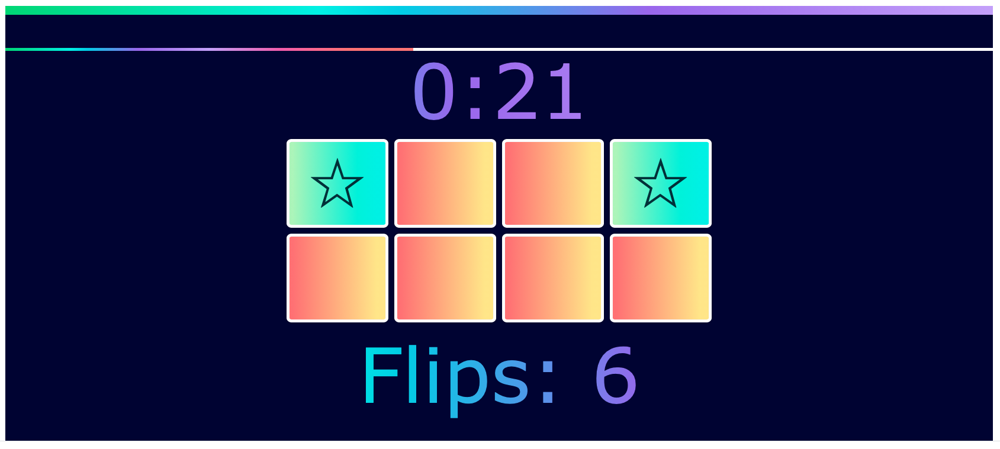
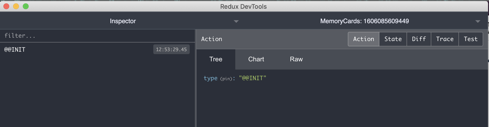

## Topic

```text
Introduction to State Management:
- Introduction to Redux 
```

In this section we will play with get introduction to the state management with Redux.

Our plan is to implement the flips counter functionality.



For the simplicity we will work with the simplified official toolset from the Redux:

https://redux-toolkit.js.org/ 


### Additional reading

Redux core concept quick introduction:

https://redux.js.org/introduction/core-concepts


An example use case for Redux:

https://www.newline.co/fullstack-react/articles/redux-with-mark-erikson/


How does redux work - more advanced explanation:

https://daveceddia.com/how-does-redux-work/

(`dispatch(action) -> reducer -> new state -> re-render`)


`react-redux` introduction:
https://react-redux.js.org/introduction/quick-start


A tutorial with `redux-toolkit`:

https://redux-toolkit.js.org/tutorials/basic-tutorial

`reselect` project for creating selectors:

https://github.com/reduxjs/reselect


### Exercise 1

`Estimated time: 10-15 min`

### Creating store and connecting it to the application

We will work in the project folder with base project:

`ts-bootcamp/src/w-05/state-management-2/base`

Task:

- Connect application with the redux store provider

Wrap the App component:

```tsx
import { Provider } from 'react-redux';
// ...
import { store } from '../../stores/redux/store';

// ...
<Provider store={store}>
</Provider>
```

Create a store object  `ts-bootcamp/src/w-05/state-management-2/solution/src/stores/redux/store.ts`:

```tsx
import {
  configureStore,
} from '@reduxjs/toolkit';
import { useDispatch } from 'react-redux';

export const store = configureStore({
  devTools: {
    name: `MemoryCards: ${Date.now()}`,
  },
  reducer: {},
});

// eslint-disable-next-line @typescript-eslint/explicit-module-boundary-types
export const useAppDispatch = () => useDispatch<AppDispatch>();

export type RootState = ReturnType<typeof store.getState>;
export type AppDispatch = typeof store.dispatch;
```

To verify everything works:




Install `redux-devtools` extension:

https://chrome.google.com/webstore/detail/redux-devtools/lmhkpmbekcpmknklioeibfkpmmfibljd

And find the `MemoryCards...` instance in the list.

Notes: 

```tsx
devTools: {
  name: `MemoryCards: ${Date.now()}`,
},
```

This lifehack is needed for better identifying of app store in redux-devtools.

### Exercise 2

`Estimated time: 10-15 min`

### Creating actions, creating reducers

Task:

- Create action to add item to the log

### Exercise 3

`Estimated time: 10-15 min`
 
### Creating selectors

Task:

- Create a selector to select the count of items in log 

### Exercise 4

`Estimated time: 10-15 min`
 
### Testing Redux state

Task:

- Write test for store to check the default values
- Write test for store to check the store after calling addLogs actions
- Write text for store to check it is cleared correctly

### Notes


