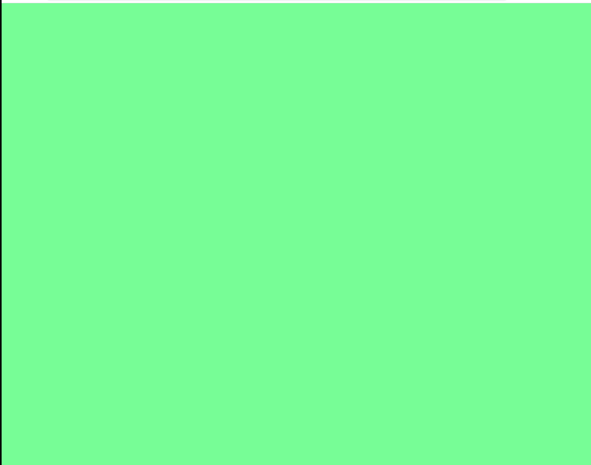
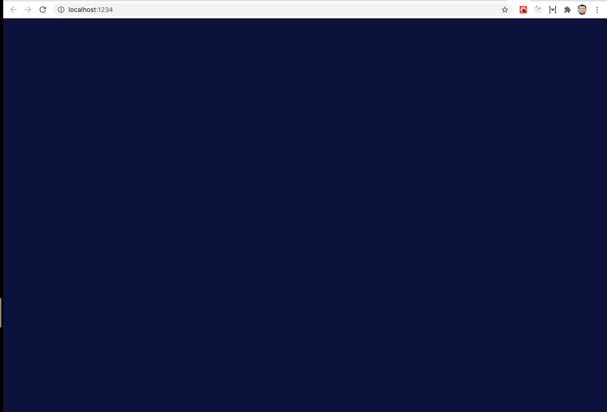
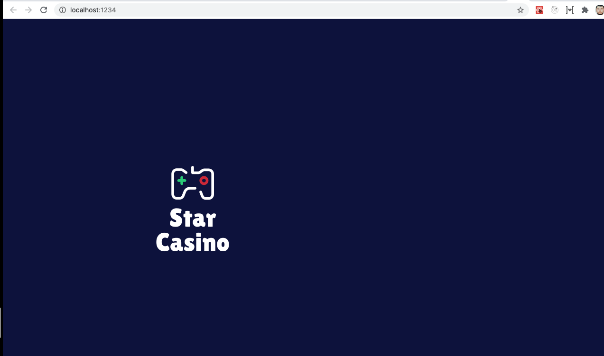
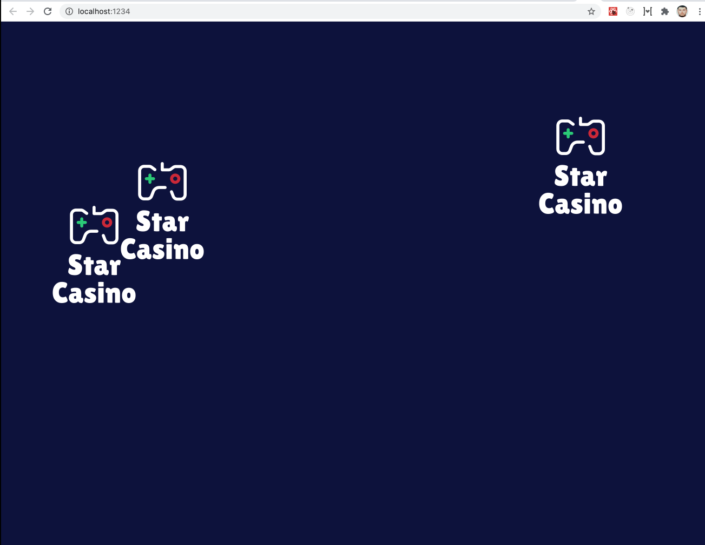
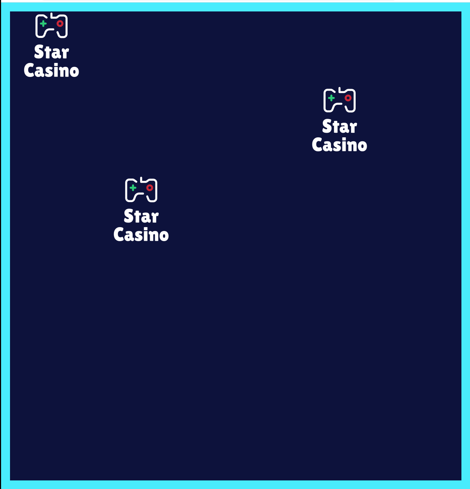

## Topic

```text
Introduction to Canvas:
- canvas element
- preparing canvas scene
- adding objects (rectangles, texts)
- animating elements
- interactions with canvas elements (adding click handler)
```

In this section we will get familiar with JS Canvas.

Our plan is to implement a simple `<Advertizing>` component to promote
casino in the shorts ads which is quite commonly used in video players in Web.


### Additional reading

Mozilla Canvas tutorial

https://developer.mozilla.org/en-US/docs/Web/API/Canvas_API/Tutorial


### Exercise 1

`Estimated time: 10-15 min`

### Creating canvas

We will work in the project folder with base project:

`ts-bootcamp/src/w-06/canvas-1/base`


Initial component code should be:

```tsx
import React from 'react';
import randomColor from 'randomcolor';

export const Advertising: React.FC = () => (
  <div style={{ background: randomColor(), width: '100%', height: '100vh' }}>
    Ads
  </div>
);

```

Task:

- Create a canvas element and the react component, fill canvas with color




Add a canvas element ref:

```tsx
const canvasEl = React.useRef<HTMLCanvasElement>(null);

// ...

return (
    <canvas ref={canvasEl} />
  );
```

Add state to control your canvas settings

```tsx
const [settings, setSettings] = React.useState<SettingsState>({
    backgroundColor: 'rgba(0, 3, 51, 1)',
  });
```

Create React effect and get the canvas context:

```tsx
React.useEffect(() => {
    const ctx = canvasEl.current?.getContext('2d')!;
    drawCanvasArea(ctx, [window.innerWidth, window.innerHeight]);
  }, []);
```

And now write a function to set canvas width, height and fill it with color from settings: 

```tsx
function drawCanvasArea(ctx: CanvasRenderingContext2D, [width, height]: Params2D) {
    ctx.canvas.width = width;
    ctx.canvas.height = height;
    ctx.fillStyle = settings.backgroundColor;
    ctx.fillRect(0, 0, width, height);
  }
```

The last thing to finish is to call the random color function from the sample at the initial state:

```tsx
const [settings] = React.useState<SettingsState>({
    backgroundColor: randomColor(),
  });
```

As a final result you should see the similar output


### Exercise 2

`Estimated time: 10-15 min`

### Blinking background

Your task would be to fill the background and make the animated alpha

Task:

- Create a react effect and change alpha in background using react state for settings:  `rgba(0, 3, 51, ${a})`
- A suggested range of values could be`[0.9, 0.95, 1]`


Let's start with changing the state:

```tsx
const [settings] = React.useState<SettingsState>({
    // ...
    backgroundColorAlpha: 1,
});
```

Let's change this state each `150ms`:

```tsx
React.useEffect(() => {
    window.setInterval(() => {
      setSettings((state) => {
        // TODO:
      });
    }, 150);
```

Now we will need to calculate next alpa value, so we would need the following function:

```tsx
function nextAlpha(value: number) {
    const alphas = [0.9, 0.95, 1];
    const nextAlphaValue = alphas[0];
    //  TODO:
    return nextAlphaValue
}
```

We will also need to adjust the render effect to "watch" the state object for changes:
```tsx
React.useEffect(() => {
    const ctx = canvasEl.current?.getContext('2d')!;
    drawCanvasArea(ctx, [window.innerWidth, window.innerHeight]);
  }, [settings]);
```

Now you should see the blinking canvas element




### Exercise 3

`Estimated time: 10-15 min`

### Adding logo image to the canvas

Your task would be to add the logos image to the canvas

Task:

- Import an image from `assets` dir in component folder and render it on canvas

Hint:

```tsx
ctx.drawImage(logo, x, y, width, height)
```

First let's load the image:

```tsx
import casinoLogo from './assets/starCasino.png';


const logo = new Image();
logo.width = 200;
logo.height = 200;
logo.src = casinoLogo;
```

Now let's draw the image at the background:

```tsx
React.useEffect(() => {
    const ctx = canvasEl.current?.getContext('2d')!;
    drawCanvasArea(ctx, [window.innerWidth, window.innerHeight]);
    ctx.drawImage(logo, 300, 300, logo.width, logo.height);
  }, [settings]);
```

Now you will see the canvas updated



We will need to adjust the state to store the random coordinates

```tsx
  logosRandomCoeffs: Params2D[];
```

And a function to randomly draw several images at the screen

```tsx
// eslint-disable-next-line max-len
  function drawLogos(ctx: CanvasRenderingContext2D, [width, height]: Params2D, coeffs : Params2D[]) {
    // eslint-disable-next-line no-restricted-syntax
    for (const [randomX, randomY] of coeffs) {
      const x = Math.floor(randomX * (window.innerWidth - width));
      const logosAreaHeight = window.innerHeight * 0.75;
      const y = Math.floor(randomY * (logosAreaHeight - height));
      drawLogo(ctx, [width, height], [x, y]);
    }
  }
```

To generate random positions we will need to add additional effect to randomly change the coefss. A utility to help:
```tsx
function generateRandomLogosPositions(): Params2D[] {
  return [
    [Math.random(), Math.random()],
    [Math.random(), Math.random()],
    [Math.random(), Math.random()],
  ];
}
```

You should see now the ready random images on the canvas appearing:



### Exercise 4

`Estimated time: 10-15 min`

### Canvas area border

Your task would be to draw the border for the background and change it's color each `500ms`

Task:

- Create a "border using" set of `ctx.lineTo`, `ctx.moveTo` instructions

Hint:
```tsx
ctx.beginPath();
// ... instructions what to draw
ctx.closePath();
```

Hint:
```tsx
// Change line props
ctx.lineWidth = width;
ctx.strokeStyle = color;
ctx.stroke();
```




## Notes

Window request animation frame:

https://developer.mozilla.org/ru/docs/DOM/window.requestAnimationFrame
